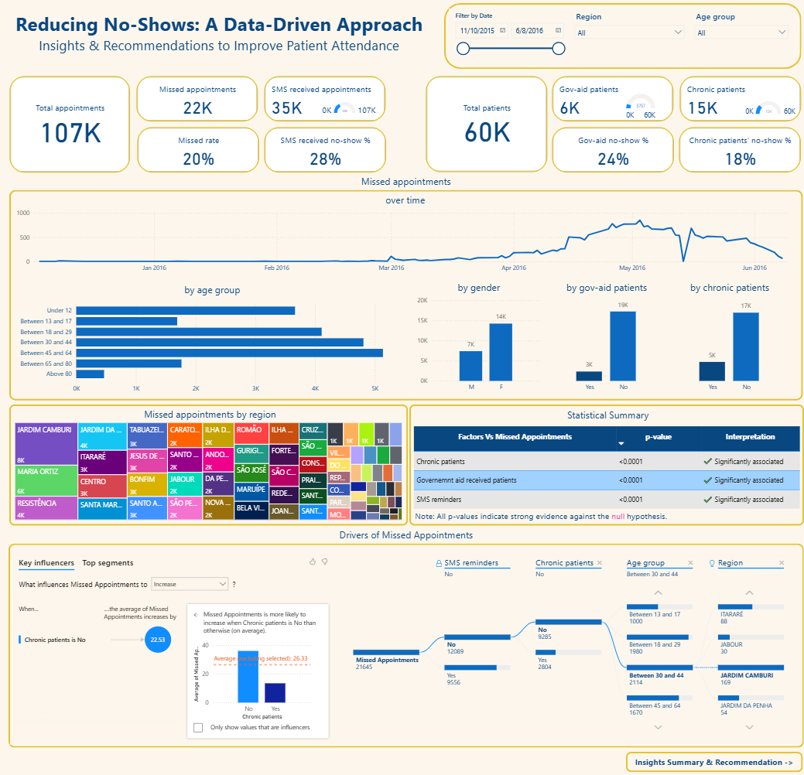
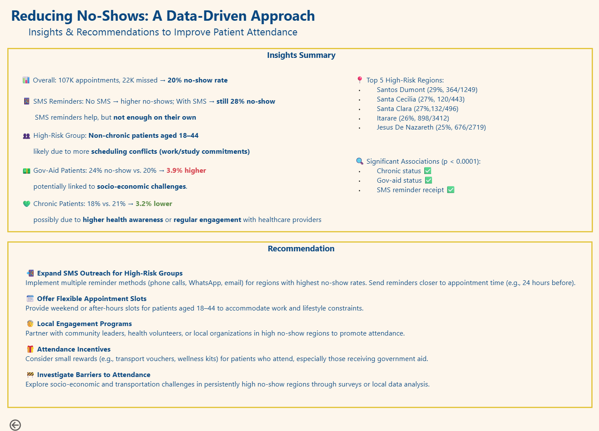

# Missed Appointments Analysis 📊

This project analyzes patient no-shows for medical appointments using a public dataset from Kaggle. It demonstrates cloud-based data querying (BigQuery), data modeling, and dashboard creation in Power BI.

---

## 🎯 Objective

Healthcare providers lose time and money due to missed appointments. This analysis seeks to answer:

- Who are more likely to miss appointments?
- Does age, gender, or chronic illness affect no-show rates?
- Do SMS reminders reduce missed appointments?
- Are there time-of-week patterns in no-shows?

---

## 📦 Dataset

- Source: [Kaggle - No-show Appointments Dataset](https://www.kaggle.com/datasets/joniarroba/noshowappointments)
- Rows: ~110K appointment records
- Key columns: `Gender`, `Age`, `Neighbourhood`, `Diabetes`, `SMS_received`, `No-show`

---

## 🗂️ Project Structure

- **Data Source**: [Kaggle - No-show Appointments](https://www.kaggle.com/datasets/joniarroba/noshowappointments)
- **Cloud Database**: Google BigQuery
- **Data Modeling**: Star Schema modeling inside Power BI
- **Visualization Tool**: Microsoft Power BI
- **Skills Highlighted**:
  - SQL for data extraction and transformation
  - Data cleaning and transformation in Power Query
  - Dimensional modeling for BI
  - DAX measures (e.g., % missed, weekday trends, demographics)
  - Dashboard storytelling

---

## 🔧 Steps

1. **Imported** the dataset into BigQuery manually via the GCP Console.
2. **Wrote SQL** to extract useful columns and perform basic cleaning (e.g., dates, booleans).
3. **Connected BigQuery** to Power BI using the BigQuery connector.
4. **Modeled the data** using a star schema inside Power BI.
5. **Created calculated DAX measures** for:
   - % of no-shows
   - Missed rate by age/gender
   - Trends by weekday, neighborhood, scholarship
6. **Designed a dashboard** to visualize insights and help clinics reduce no-shows.

---

## 📷 Dashboard Preview

---

## 📁 Files in this Repo

| Folder | Description |
|--------|-------------|
| `sql/` | BigQuery SQL scripts used to extract and clean data |
| `powerbi/` | Power BI `.pbix` file |
| `assets/` | Dashboard screenshots |
| `data/` | Placeholder for data reference (no raw data included) |

---

## 🧠 Insights & Recommendation

---

## ⚙️ Tools Used

- Google Cloud Platform: BigQuery
- Microsoft Power BI
- SQL
- DAX

---

## 📜 License

MIT License – see the [LICENSE](LICENSE) file.

---

## 🙋 About Me

I'm a data engineer and analyst based in Auckland, New Zealand. This project is part of my portfolio to demonstrate my skills in data analysis and visualization. Feel free to connect with me!

